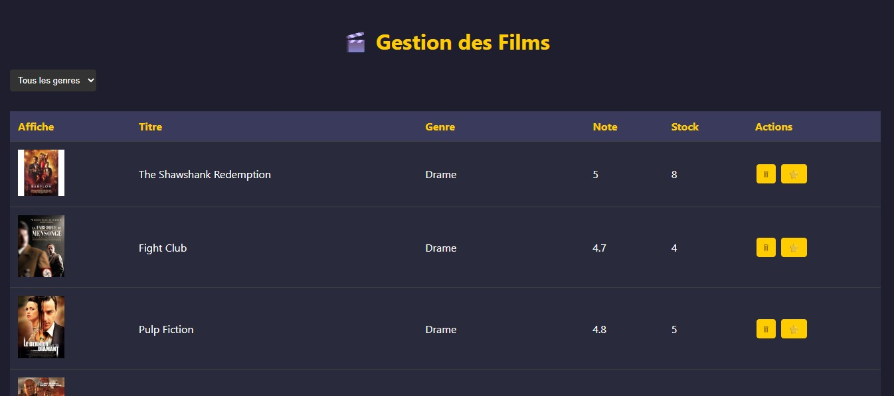

# 🎬 Films App


<p align="center">
  
</p>

A full-stack web application for browsing, managing, and interacting with movie data.
This project is divided into a backend API and a frontend user interface.

---

## 🧠 Features

- Browse a list of films  
- View detailed film information  
- Search and filter films  
- Backend–Frontend separation  
- REST API consumption from frontend  

---

## 🗂 Project Structure

```
films-app/
├── backend/       # Backend API (PHP / Node / etc.)
├── frontend/      # Frontend UI (HTML, CSS, JS, etc.)
├── .gitignore
└── README.md
```

---

## 📦 Tech Stack

- **Frontend:** HTML, CSS, JavaScript, Bootstrap  
- **Backend:** PHP  
- **Database:** MySQL  
- **Server:** Localhost (XAMPP / WAMP)

---

## 🚀 Installation & Setup

### 1️⃣ Clone the repository

```bash
git clone https://github.com/Ki-sra/films-app.git
cd films-app
```

---

### 2️⃣ Backend Setup

1. Move the project to your server directory (e.g. `htdocs`)
2. Import the database into MySQL
3. Update database credentials in backend configuration
4. Start Apache & MySQL

---

### 3️⃣ Frontend Setup

1. Open the `frontend` folder
2. Run using a local server or open `index.html`
3. Make sure the backend API URL is correct

---

## 🛠 Usage

- Start backend server  
- Open frontend in browser  
- Browse, search, and manage films  

---

## 📸 Screenshots

_Add screenshots here if needed_

---

## 🧑‍💻 Author

**Hamza Kousra**
**Ayoub Aguezar**
ISTA Ouarzazate – Digital Development  

---

## 📄 License

This project is for educational purposes.
